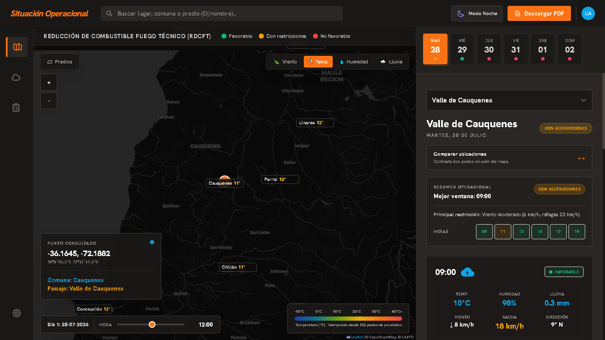

# Plataforma RDCFT · Situación Operacional

Visor meteorológico para evaluar ventanas operacionales de **Reducción de Combustible por
Fuego Técnico** (quema prescrita) en la zona centro-sur de Chile.

Cruza el pronóstico horario con umbrales de prescripción y responde a la pregunta
operativa: *¿se puede quemar hoy en este sector, y a qué hora?*



## Qué hace

- **Semáforo por hora y por día** — Favorable / Con restricciones / No favorable, evaluado
  sobre la ventana operacional (09:00 a 19:00). El indicador diario toma la **peor** hora:
  basta una fuera de prescripción para que el día no sea limpio.
- **Mapa de calor** de temperatura, humedad y precipitación, anclado al terreno e
  interpolado por distancia inversa desde puntos de pronóstico reales.
- **Partículas de viento** con la dirección y velocidad del punto y hora seleccionados.
- **Capa de predios** cargada bajo demanda desde un GeoJSON local.
- **Comparación A/B** de dos sectores sin salir del mapa.
- **Informe imprimible** con el pronóstico horario y la evaluación del día.

## Umbrales

| Variable | Con restricciones | No favorable |
|---|---|---|
| Temperatura | > 21 °C | > 26 °C |
| Humedad relativa | < 45 % | < 30 % |
| Viento | > 12 km/h | > 20 km/h |
| Ráfagas | > 20 km/h | > 30 km/h |
| Precipitación | — | > 5 mm |

Están centralizados en [`src/config.js`](src/config.js). **Pendiente:** trazarlos a una
prescripción oficial (CONAF u otra) y documentar la fuente.

## Ejecutar localmente

El proyecto no necesita compilación ni dependencias. Basta con servirlo por HTTP:

```bash
npx serve .          # o cualquier servidor estático
python -m http.server 8000
```

En VS Code, la extensión **Live Server** también sirve.

> Abrirlo con doble clic (`file://`) funciona para casi todo, pero la **capa de predios no
> cargará**: `fetch()` sobre un archivo local está bloqueado por CORS.

## Estructura

Módulos en `src/`, cargados como scripts clásicos en orden de dependencia desde
`index.html`. No son módulos ES a propósito, para no exigir un servidor en el caso simple.

| Módulo | Responsabilidad |
|---|---|
| `config.js` | Umbrales, capas, paisajes, puntos de muestreo |
| `state.js` | Estado compartido |
| `utils.js` | Fechas, coordenadas, rumbo de viento, escapado |
| `rdcft.js` | Motor de evaluación (sin DOM) |
| `weather.js` | Open-Meteo, Nominatim, indexado horario |
| `field.js` | Interpolación espacial y escalas de color |
| `theme.js` | Modo día / noche |
| `map.js` | Leaflet, capas base, predios, marcadores |
| `canvas.js` | Mapa de calor y partículas |
| `ui.js` | Renderizado del panel y la leyenda |
| `pdf.js` | Informe imprimible |
| `main.js` | Arranque, eventos y comparación |

## Datos y atribución

| Fuente | Uso | Licencia |
|---|---|---|
| [Open-Meteo](https://open-meteo.com/) | Pronóstico horario y diario | Gratuito, sin clave, uso no comercial |
| [Nominatim / OpenStreetMap](https://nominatim.org/) | Búsqueda y geocodificación inversa | ODbL · máx. 1 petición/s |
| [Esri World Imagery](https://www.arcgis.com/) | Base satelital | Atribución requerida |
| [CARTO](https://carto.com/basemaps/) | Bases clara y oscura | © OpenStreetMap, © CARTO |

Las atribuciones se muestran en el control de Leaflet. El acceso a Nominatim está limitado
a una petición por segundo en [`src/weather.js`](src/weather.js), conforme a su política.

## Despliegue

Sitio estático sin build. En **Cloudflare Pages**:

| Ajuste | Valor |
|---|---|
| Comando de compilación | *(vacío)* |
| Directorio de salida | `/` |
| Rama de producción | `main` |

## Limitaciones conocidas

- **Tailwind por CDN.** Cómodo, pero añade ~400 kB y avisa por consola que no es para
  producción. Para una versión definitiva conviene generar el CSS con la CLI de Tailwind.
- **El pronóstico es puntual.** El campo del mapa se interpola entre puntos de muestreo;
  no sustituye a una medición en terreno.
- **Faltan variables de comportamiento del fuego** que suelen decidir un go/no-go:
  humedad del combustible fino, días desde la última lluvia e índice de ventilación para
  dispersión de humo. El clima por sí solo no autoriza un encendido.
